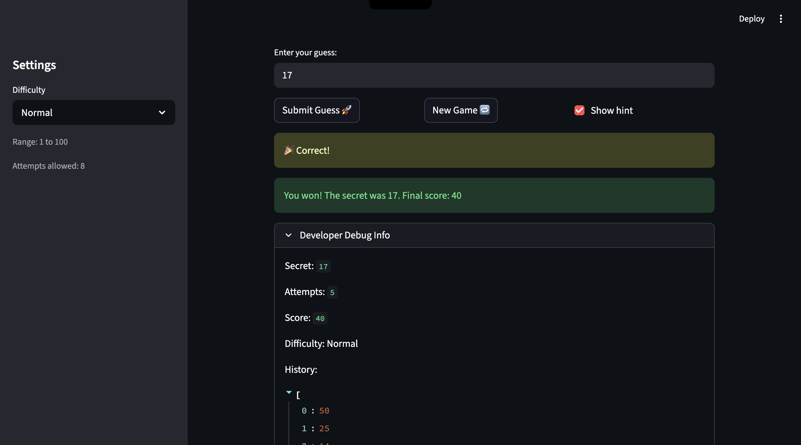
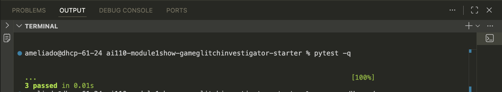

# 🎮 Game Glitch Investigator: The Impossible Guesser

## 🚨 The Situation

You asked an AI to build a simple "Number Guessing Game" using Streamlit.
It wrote the code, ran away, and now the game is unplayable. 

- You can't win.
- The hints lie to you.
- The secret number seems to have commitment issues.

## 🛠️ Setup

1. Install dependencies: `pip install -r requirements.txt`
2. Run the broken app: `python -m streamlit run app.py`

## 🕵️‍♂️ Your Mission

1. **Play the game.** Open the "Developer Debug Info" tab in the app to see the secret number. Try to win.
2. **Find the State Bug.** Why does the secret number change every time you click "Submit"? Ask ChatGPT: *"How do I keep a variable from resetting in Streamlit when I click a button?"*
3. **Fix the Logic.** The hints ("Higher/Lower") are wrong. Fix them.
4. **Refactor & Test.** - Move the logic into `logic_utils.py`.
   - Run `pytest` in your terminal.
   - Keep fixing until all tests pass!

## 📝 Document Your Experience

- [x] Describe the game's purpose.
- [x] Detail which bugs you found.
   - Hint direction messaging was incorrect (too high/too low guidance was inconsistent).
   - New game/reset behavior did not always fully reinitialize state.
   - Game logic was mixed with UI code, which made debugging and test coverage harder.
- [x] Explain what fixes you applied.
   - Refactored core game functions into `logic_utils.py` for clearer separation of concerns.
   - Corrected hint-direction behavior in `check_guess` and validated with tests.
   - Improved reset/session-state handling in `app.py` so state is consistently managed across reruns.
   - Updated tests in `tests/test_game_logic.py` to validate both outcomes and player-facing hint messages.

## 📸 Demo

- [x] Insert a screenshot of your fixed, winning game here.
   

### Challenge 1: Advanced Edge-Case Testing

- [x] Included in this submission.
   

## 🚀 Stretch Features

- [ ] [If you choose to complete Challenge 4, insert a screenshot of your Enhanced Game UI here]
